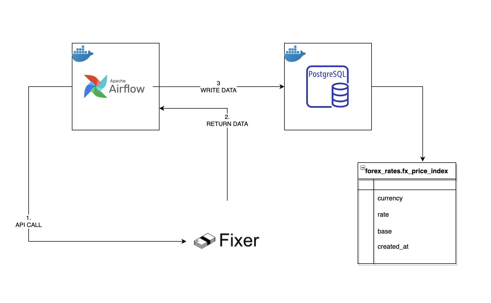
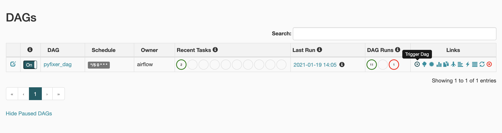
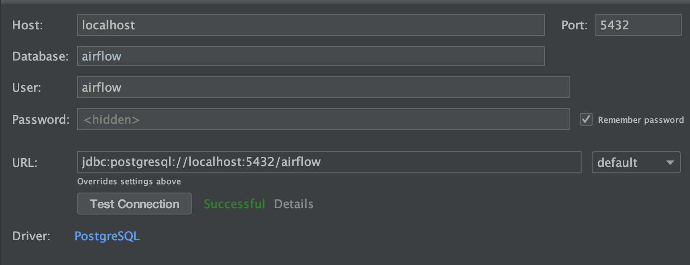

# DocFixer

DocFixer is a containerized app that streams forex rates from `https://fixer.io/` into a Postgres database.

## Infrastructure:

All the services in this app are encapsulated in Docker Containers.

The Infrastructure and flow of the app looks like this:

Airflow takes care of executing and scheduling a python job that runs every 5 minutes and updates the table `forex_rates.fx_price_index`.

## How to run it:
### Prerequisites:
- Docker version 19.03.13 (or above)
- GNU Make 3.81 (or above)

#### Steps:

1. Git clone the repo
2. Cd to the Root directory of the repo
3. Run `make _start_cluster` : This will build and start the entire infrastructure. This can take several minutes because the first time you nees to download the docker images.
4. Once the cluster is up and running can go into your browser to http://localhost:8080/ . Where you will have an Airflow Dag ready to run.
5. Click on trigger DAG:

6. Once the dag runs successfully  you can check the data in the Postgres database. To do so, you can use you database manager and log in using this credentials and the password `airflow`:

7. The Dag is set to run every 5 minutes inserting only one rate per pair of currencies and date.
8. When you want to stop the cluster: cd to the root of the repo and run `make _stop_cluster`
9. If you  want to restart it run: `make _restart_cluster`.